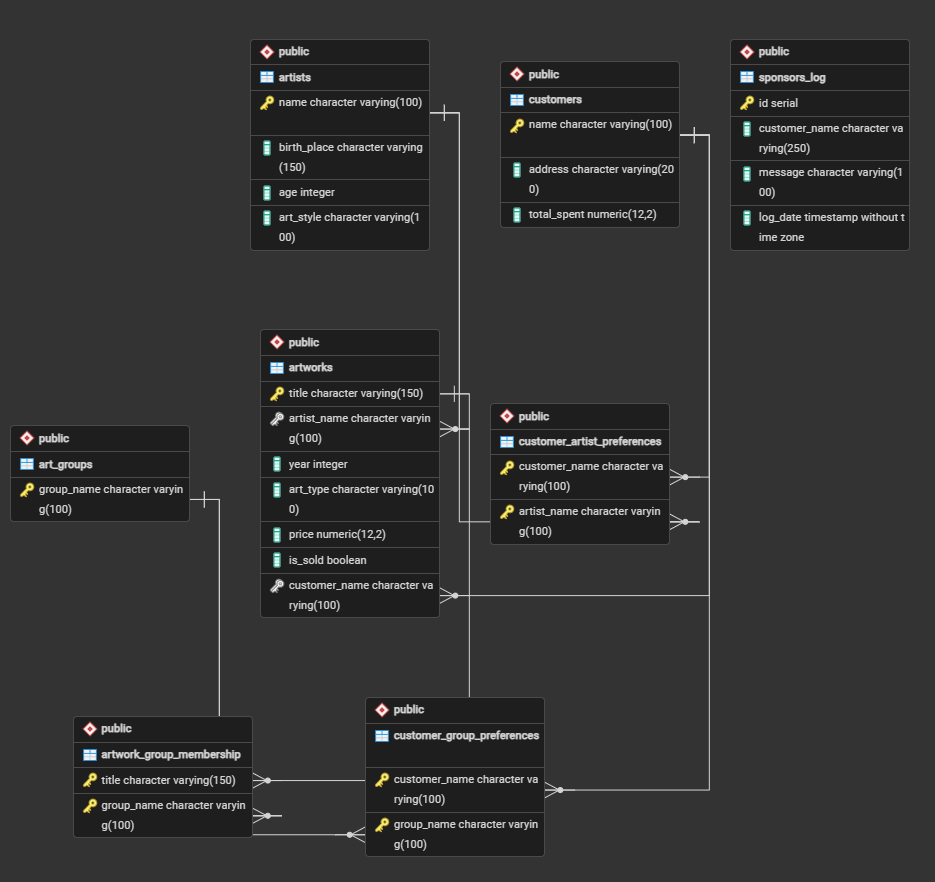

# Relational Database System (SQL & ERD)

## 📌 Overview
This repository contains the design and implementation of a Relational Database System developed for the **Database Systems** course at the **University of Piraeus**.

## 🛠️ Tech Stack
- **Database Language:** SQL
- **Database Modeling:** Entity-Relationship Diagrams (ERD), Relational Schema

## 📐 ER Diagram

## 📁 Repository Structure
- `erd-diagram.png` : Entity-Relationship Diagram showing entities, attributes, and relations.
- `schema-and-queries.sql` : Complete SQL script including DDL (tables, keys, constraints) and DML (inserts, queries).
